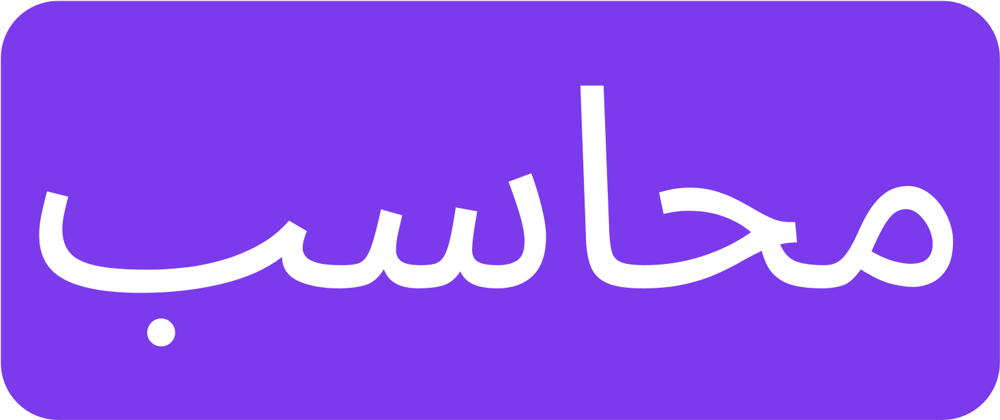

    
    
Your personal accounting tool

Welcome to Muhasib, an expense tracking app for you and your friends. I got tired of looking for solutions that are expensive yearly and require instances of databases to run. Hopefully I can develop this as a simple deployment on Vercel so it can be used freely by anyone who wishes to deploy, or just release this as a subscription product at some point.

This project is currently under development. Please contact me if you want to contribute.

This project will use [Shadcn UI](https://ui.shadcn.com) and [Tanstack Start](https://tanstack.com/start/latest).

## Planned Features

- OAuth for Authentication with Next Auth
- Ability to add multiple accounts
    - Checking accounts
    - Credit Cards
- Ability to split expenses with friends
- Ability to add split expenses to an account
